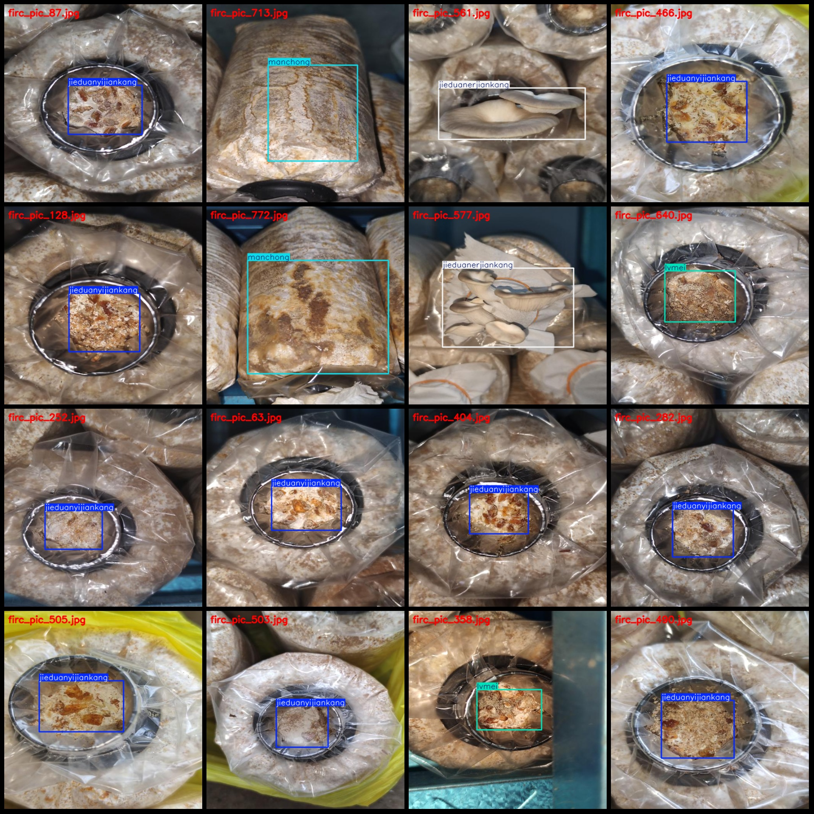
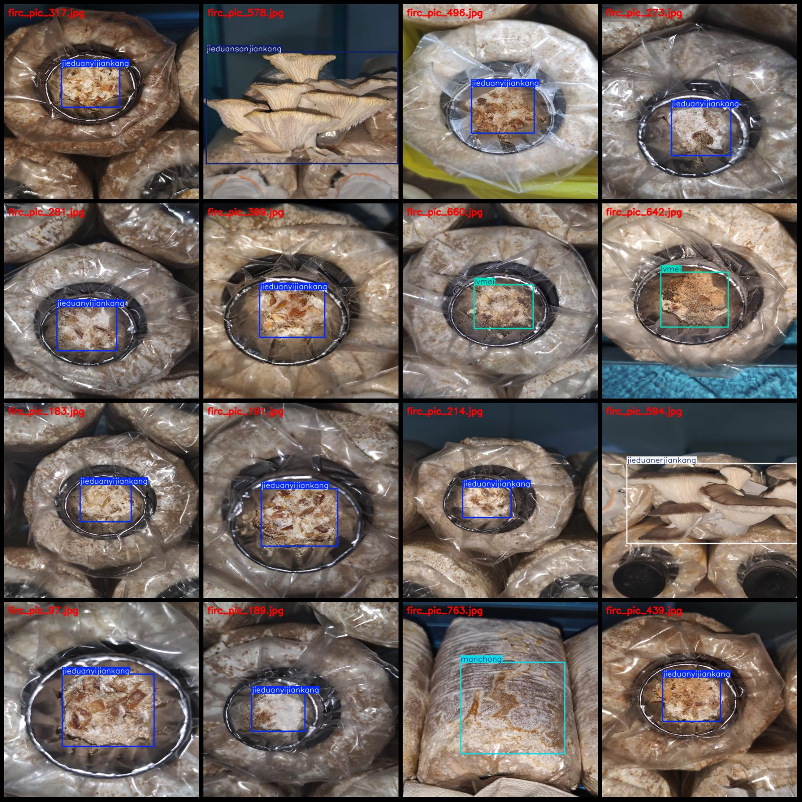

# Healthy and Diseased Mushroom Detection Dataset with VOC+YOLO Format: 785 Images in 5 Categories

Dataset format: Pascal VOC format + YOLO format (txt file without split path, only containing jpg images and corresponding VOC format xml files and yolo format txt files)

Number of images (jpg files): 785
Number of annotations (xml files): 785
Number of annotations (txt files): 785
Number of categories: 5
Annotation category names: ["Stage 2 Health", "Stage 3 Health", "Stage 1 Health", "Green Mold", "Mite"]
["Stage 2 Health", "Stage 3 Health", "Stage 1 Health", "Green Mold", "Dust Mites"]
Number of bounding boxes for each category:
jieduanerjiankang: 22
jieduansanjiankang: 60
jieduanyijiankang: 493
lvmei: 98
manchong: 112
Total bounding boxes: 785
Number of images each category occupies:
jieduanerjiankang: 22
jieduansanjiankang: 60
jieduanyijiankang: 493
lvmei: 98
manchong: 112
Image resolution: 512x512
Annotation tool used: labelImg
Annotation rules: draw bounding boxes for categories
Special notice: The dataset does not have separate training, validation, and test sets; they need to be manually divided.
Special declaration: This dataset does not guarantee the accuracy of the trained models or weight files.
Image preview:
## Images

Here is a pay link on Stripe ( https://buy.stripe.com/3cs8yP7sY87d0vu9AB ). Please contact me lonlonago@foxmail.com after funding $89, and I will send you a complete data files , thank you!

